# Lab 01 Instructions

## Overview
This lab uses snappi to control the free Ixia-c Community Edition (OTG Test Tool) to send traffic between 2 hosts from the same AWS VPC. The lab has 2 parts. In the first part (traffic only) we will deploy the Ixia-c traffic engines and controller using **docker run** then in the second part (protocols and traffic) we will add the Ixia-c Protocol Engine component. The deployment will be simplified by using **docker compose**.

The test scripts have been already created and the goal of the lab is to instruct users how to send traffic between these 2 servers with various parameters.


## Prerequisites
- Check docker version

```Shell
docker version
```
- Install snappi

```Shell
python3 -m pip install --upgrade snappi --break-system-packages
```
- Clone the git repository associated with this workshop 

```Shell
git clone https://github.com/open-traffic-generator/ac4-workshop.git
```

Optionally, you can set this up in Visual Studio Code. It will be much easier to modify files and start new terminals. You will need to install the “Remote SSH” and “Remote Explorer” extensions then add the VM hosts by editing the ssh config to include the IdentifyFile parameter. Refresh the list of hosts, connect, follow the prompts to continue and open the ***/home/ubuntu*** folder.

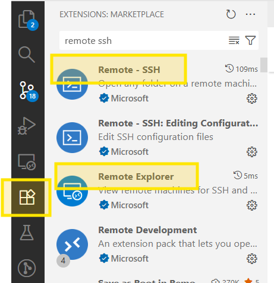


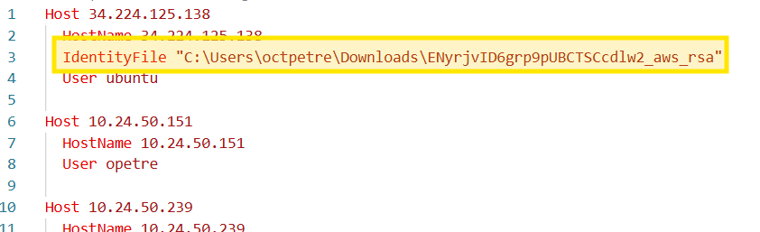

Example SSH command for Windows:

`
ssh -i C:\\Users\\USER\\Downloads\\ENA8FWiOpusuWSA3PIMPcocw2_aws_rsa ubuntu@SERVERIP
`

Example SSH command for Mac or Linux:

`
ssh -i /home/USER/Downloads/ENA8FWiOpusuWSA3PIMPcocw2_aws_rsa ubuntu@SERVERIP
`

## Execution
### Part 1

- Let's pull the docker images needed for this lab

```Shell
docker pull ghcr.io/open-traffic-generator/keng-controller:1.40.0-15
docker pull ghcr.io/open-traffic-generator/ixia-c-traffic-engine:1.8.0.245
```


We'll deploy 2 containers on VM1 (KENG tontroller and Ixia-C traffic engine) and one container on VM2 (Ixia-C traffic engine) using ***docker run***


On VM1 deploy the controller. Here we're using the network mode "host" but Ixia-C containers could also be deployed in custom bridge. [Ixia-c deployments examples](https://github.com/open-traffic-generator/ixia-c/tree/main/deployments)

```Shell
docker run -d --name=keng-controller --network host ghcr.io/open-traffic-generator/keng-controller:1.40.0-15 \
--accept-eula \
--http-port 8443
```

- On VM1 deploy the Ixia-C traffic engine. Notice the nic name **ens6**  used.
```Shell
docker run --privileged -d                    \
   --name=lab-01-traffic-engine               \
   --network host                             \
   -e OPT_LISTEN_PORT="5551"                  \
   -e ARG_IFACE_LIST="virtual@af_packet,ens6" \
   -e OPT_NO_HUGEPAGES="Yes"                  \
   -e OPT_NO_PINNING="Yes"                    \
   -e WAIT_FOR_IFACE="Yes"                    \
   -e OPT_ADAPTIVE_CPU_USAGE="Yes"            \
   ghcr.io/open-traffic-generator/ixia-c-traffic-engine:1.8.0.245             
```
- On VM2 deploy the Ixia-C traffic engine.
```Shell
docker run --privileged -d                    \
   --name=lab-01-traffic-engine               \
   --network host                             \
   -e OPT_LISTEN_PORT="5551"                  \
   -e ARG_IFACE_LIST="virtual@af_packet,ens6" \
   -e OPT_NO_HUGEPAGES="Yes"                  \
   -e OPT_NO_PINNING="Yes"                    \
   -e WAIT_FOR_IFACE="Yes"                    \
   -e OPT_ADAPTIVE_CPU_USAGE="Yes"            \
   ghcr.io/open-traffic-generator/ixia-c-traffic-engine:1.8.0.245             
```
- On VM1 open **lab-01-part1.py** and set the controller and port location attributes. This is the management IP for each Ixia-c port. Since we're using the controller on VM1, the location of port1 should be 'localhost' but the location of port2 should point to the management IP of VM2 host. This address usually is present in the prompt

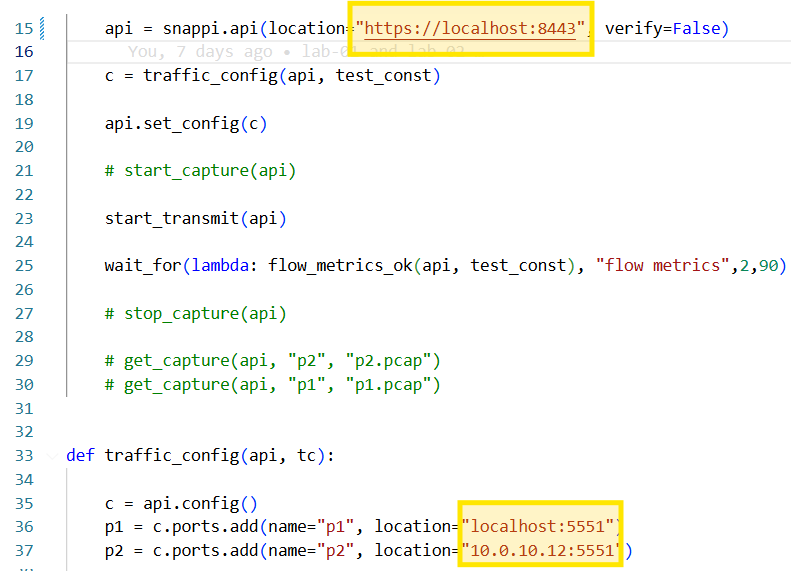


- Since we're running in AWS VPC, promiscuous mode is disabled and the endpoints must match the interface configurations. 
On VM1 run `arp` to find out the MAC address of your gateway (10.0.2.1), then run `ip address` to find out the interface MAC and IPv4

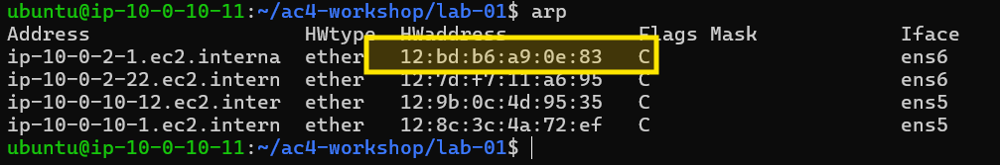
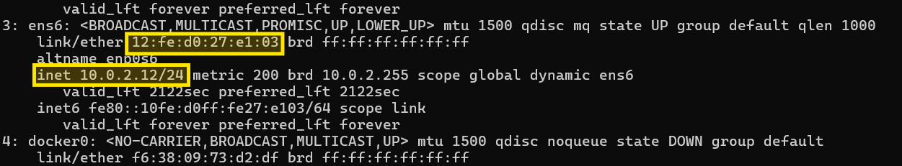

- On VM2 terminal, run `ip address` to retrieve the MAC and IPv4 interface information. The gw address is the same as on VM1


- Back on VM1 let's open the script lab-01-part1.py and make these changes. There are 2 flows, one for each transmitting port.

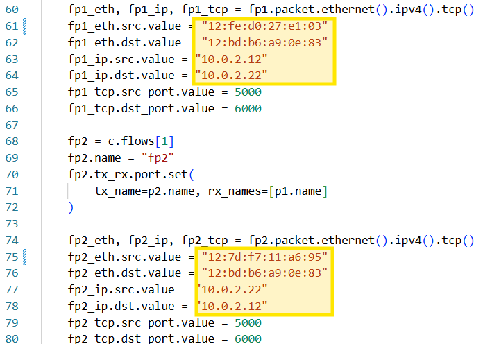

- Run the script and observe the results

```Shell
python3 lab-01-part1.py
```


- Change the script to generate 2 Mbps on each flow and rerun


- Stop and remove the containers for part1 of this lab

```Shell
docker stop $(docker ps -aq) && docker rm $(docker ps -aq)
```


### Part 2

This time we're adding the Ixia-C Protocol Engine component. This will ensure that ARP is resolved and the destination MAC address is automatically populated. As you can see in the diagram below we need to deploy 3 containers on each VM but we will only use the VM1 controller (VM2 Keng Controller container is optional)

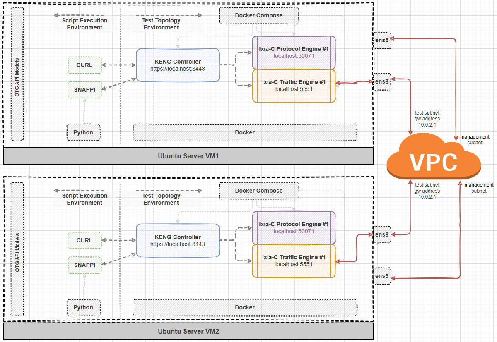

The configuration will include devices which will be used as endpoints for traffic.
- Open **compose.yml** file and notice the 3 containers. We're binding the traffic engine to **ens6** and the Ixia-C Protocol Engine is using the Ixia-C Traffic Engine network setting. 

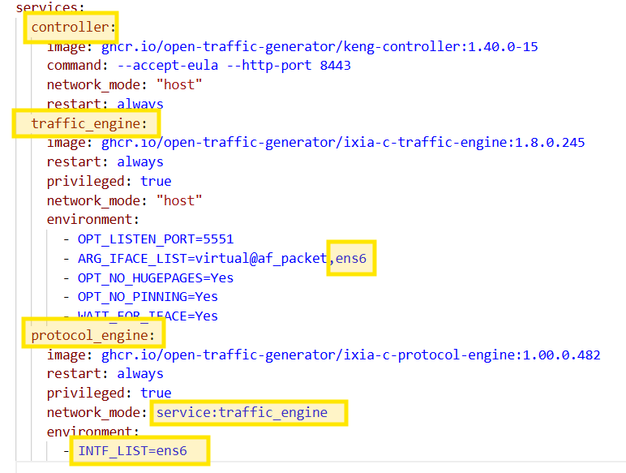

- On both terminals run **docker compose** to deploy the containers

```Shell
cd ~/ac4-workshop/lab-01/
docker compose up -d
```

- Check the containers and the traffic engine log from one of them.

```Shell
docker ps
docker logs lab-01-traffic_engine-1
```

- Check the ***Interface ens6 found*** log


- Let's open the script **lab-01-part2.py** and make the changes to match the interface information: management IP, test IP and MAC address. You can use `arp` and `ip address` commands to retrieve these.
Because we're now using the protocol engine, this must be specified in the port "location" attribute. Unlike the traffic engine where the port can be changed, the protocol engine will always be "listening" on port 50071

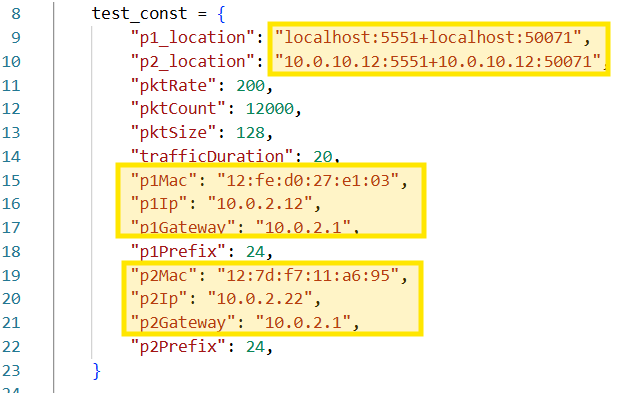

Notice now the flow configuration has no destination mac address set. That is because we're using flow tx_rx parameter set to ***device*** which will populate the destination mac address upon completion of the ARP request

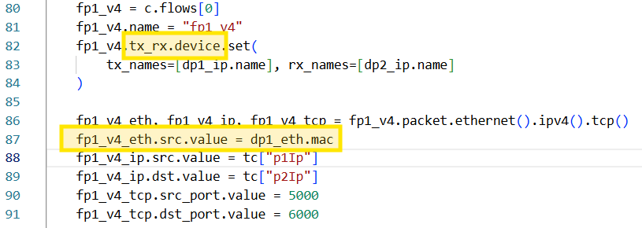

- Run the test and observe stats.

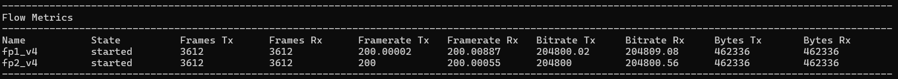

- Enable capture in the script by uncommenting the capture specific steps then run the test.
Set the ***pktCount*** to 200 and run the test

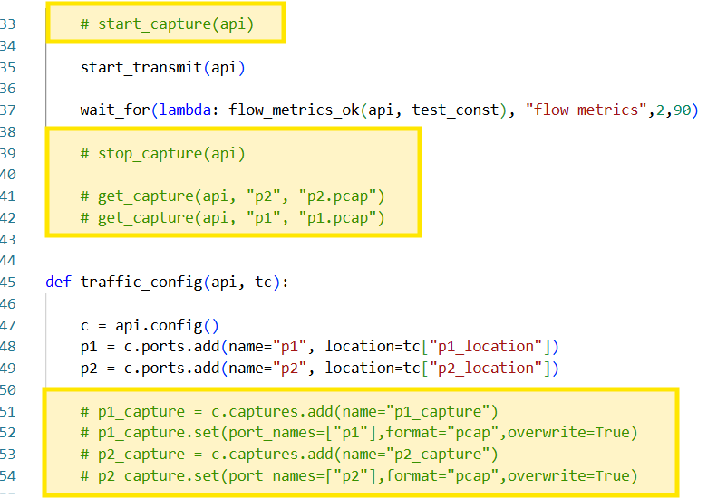

- Run `ls` at the end to see 2 files containing the captured packets. With keng we can only capture incoming packets.

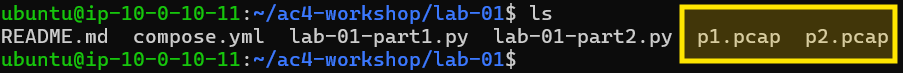

- Let's run some manual curl commands for retrieving the port stats, flow stats and ARP table.

```Shell
curl -k -X POST https://127.0.0.1:8443/monitor/metrics -d '{"choice":"port"}'
curl -k -X POST https://127.0.0.1:8443/monitor/metrics -d '{"choice":"flow"}'
curl -k -X POST https://127.0.0.1:8443/monitor/states -d '{"choice":"ipv4_neighbors"}'
```
As you can see in the port metrics, we're receiving more frames on P1 than what P2 is sending. This is filtered correctly by Keng as see in the flow metrics.

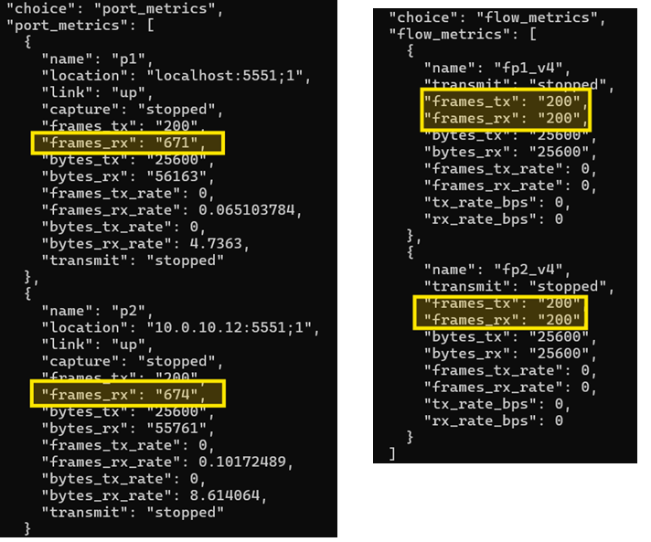

- See the entire controller configuration in json format

```Shell
curl -k https://127.0.0.1:8443/config
```

- Clear the containers on both VMs

```Shell
cd ~/ac4-workshop/lab-01/ && docker compose down
```
