# Lab 02 Instructions

## Overview

This lab uses [**containerlab**](https://containerlab.dev/) to deploy 3 pairs or Ixia-C traffic engine / protocol engine containers connected to 3 [**Arista ceos**](https://containerlab.dev/manual/kinds/ceos/) ports. The router is configured as a BGP route reflector and is expected to forward iBGP routes. The otg (Ixia-c) ports 2 and 3 are configured to advertise the same route but with different local preference and med parameters.

The goal of the lab is to calculate the BGP convergence when different actions are initiated on the otg peers.

We will only require 1 VM for this lab. Deployment and logical topology below.

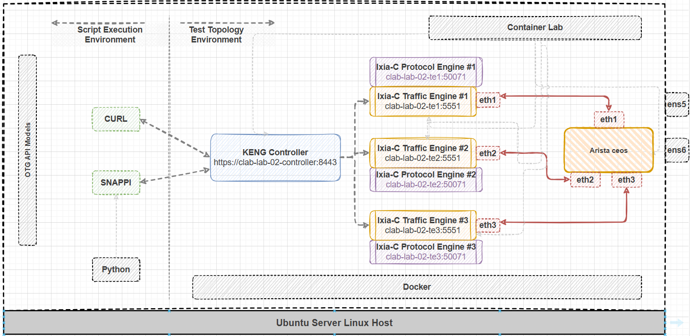


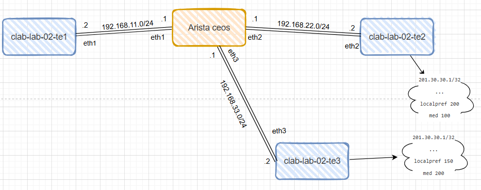

## Prerequisites

- Install **containerlab**

```Shell
bash -c "$(curl -sL https://get.containerlab.dev)"
```

- snappi must be installed at this point. If not, use the command below to do it

```Shell
python3 -m pip install --upgrade snappi --break-system-packages
```


## Execution

Observe the containerlab topology file. Notice the parameters are the same as those used in the previous lab.


- Deploy the topology using containerlab.

```Shell
cd ~/ac4-workshop/lab-02/ && clab deploy
```
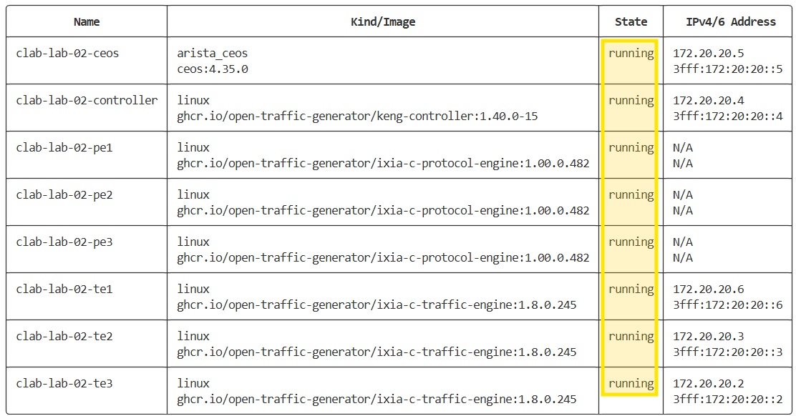

- Unlike the previous lab, with containerlab we're using custom bridge docker networking.

```Shell
docker network ls
docker inspect clab
```

- Open the test script **lab-02.py** and modify the location attributes for each port along with the controller address. Also, please set the **packet count** to 60000. 

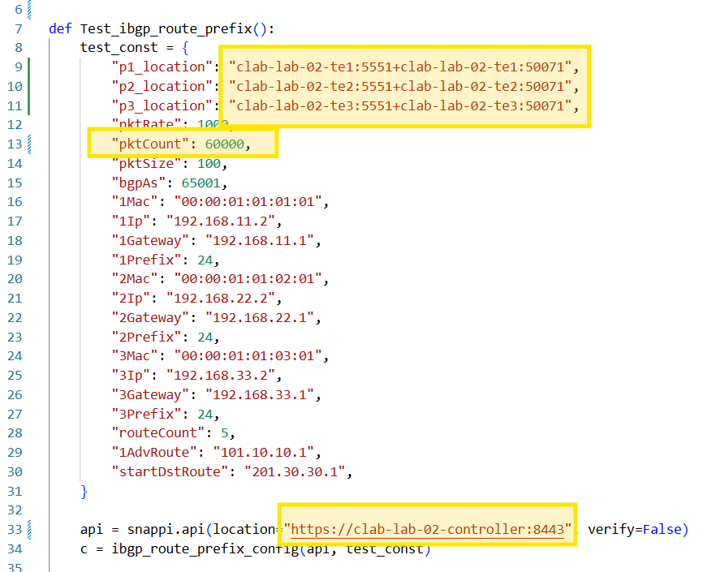

- After the routes are advertised by each otg peer, the script will check bgp states and routes then traffic will be sent from otg port 1 towards the destination routes 201.30.30.x/32. Initially, the router should forward these packets towards otg port 2 (preferred route) but after a "link-down" operation is initiated on otg port 2, the traffic should converge towards otg port 3. The convergence time is the total lost packets divided by the packet rate.
Make sure ***link-operation*** lines are active.

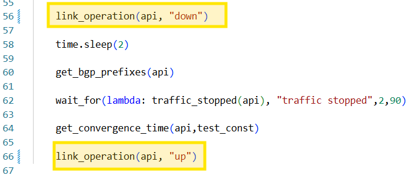

- Optionally, open another terminal, connect to the DUT `ssh clab-lab-02-ceos` (password ***admin***) and watch the bgp routes on the DUT. 

```Shell
watch show ip route bgp
```

- Run the script

```Shell
python3 lab-02.py
```
In the first 30 seconds we should see the traffic received by "p2" (with the preferred route).
The watcher on the DUT also shows that these 201.30.30.x routes are received on "Ethernet2" with med set to 100.

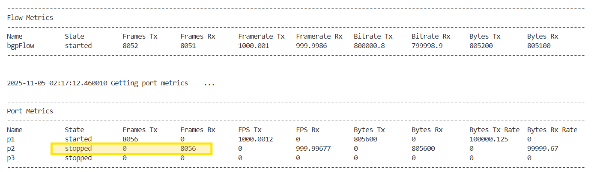
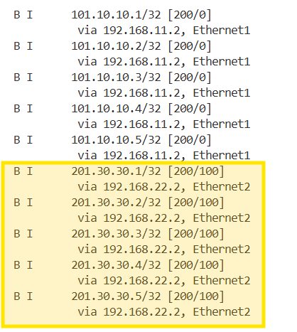

After 30 seconds we should see the traffic received by "p3" (the only route).
The watcher on the DUT also shows that these 201.30.30.x routes are received on "Ethernet3" with med set to 200.


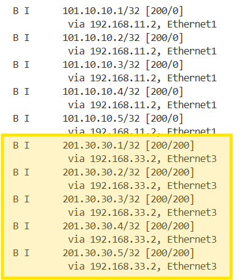

There was packet loss during the link down event. The convergence time is displayed.

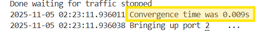

- Now let's try to manually withdraw the routes from P2. The traffic should flow without any packet loss towards P3.
  We will need the traffic to run continuously. Open **lab-02.py**, set the packet count to **6000000** packets, save and run.

```Shell
python3 lab-02.py
```

- While the traffic is running, in a separate terminal we want to interact with the controller by sending a BGP route withdraw by passing a the **body-withdraw.json** file to the rest request.

```Shell
curl -k -X POST https://clab-lab-02-controller:8443/control/state -d @body-withdraw.json
```

- Now we can see the traffic has moved to P3 with no packet loss.

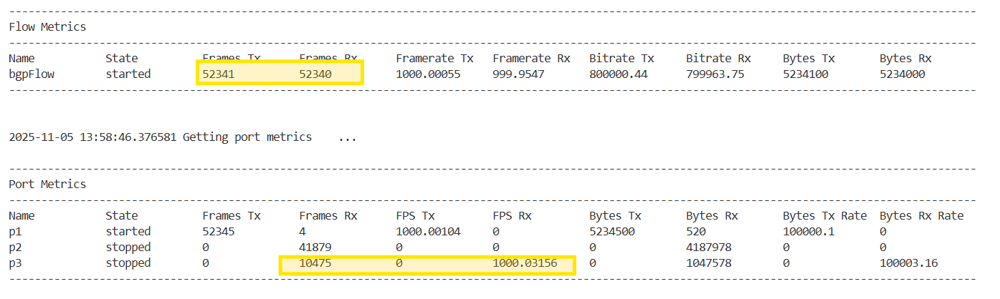

- Let's readvertise the routes now by passing the **body-advertise.json** file.

```Shell
curl -k -X POST https://clab-lab-02-controller:8443/control/state -d @body-advertise.json
```

- Traffic shifted back to P2 with no packet loss.

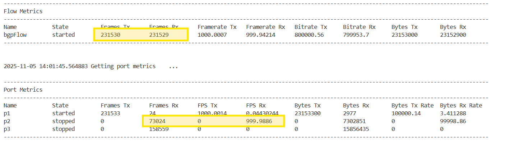


- Let's manually stop the traffic by passing the **body-stop-traffic.json** file.
```Shell
curl -k -X POST https://clab-lab-02-controller:8443/control/state -d @body-stop-traffic.json
```

## Cleanup

- Destroy the clab topology

```Shell
cd ~/ac4-workshop/lab-02/ && clab destroy --cleanup
```


