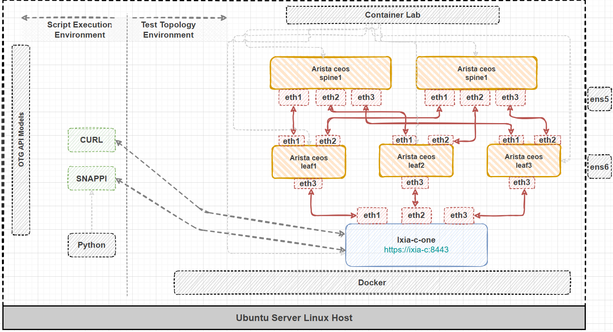
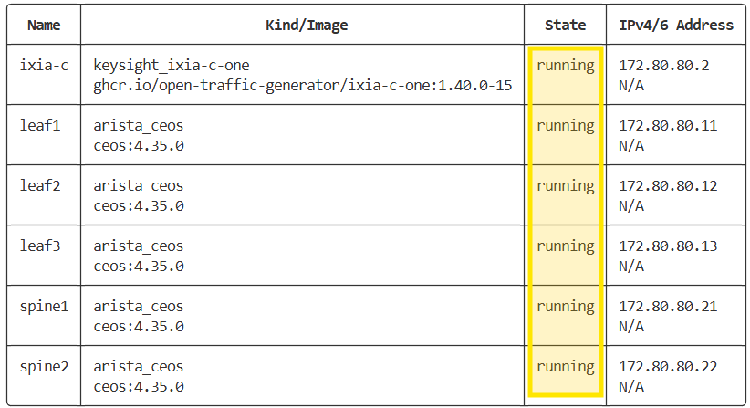
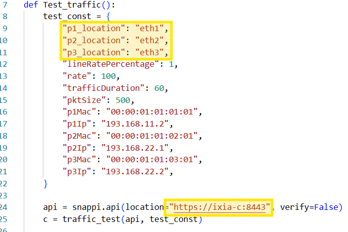
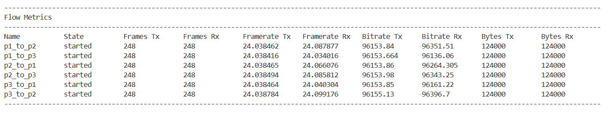
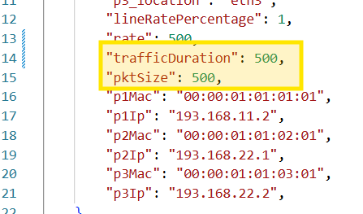
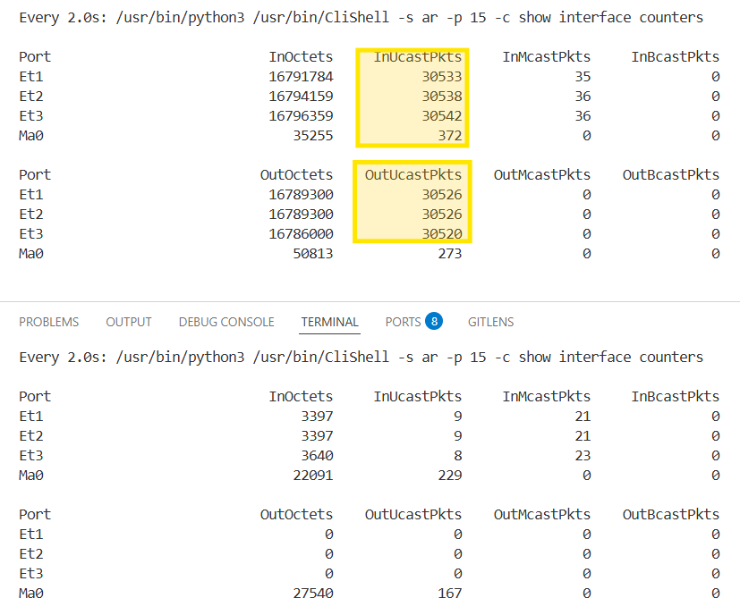
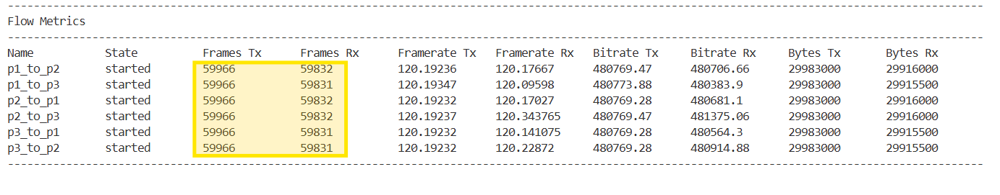

# Lab 03 Instructions

## Overview

This lab uses [**containerlab**](https://containerlab.dev/) to deploy a clos topology (3 leafs and 2 spines) using [**Arista ceos**](https://containerlab.dev/manual/kinds/ceos/) and one Ixia-c-one container with 3 interfaces connected to the 3 leaf nodes. The routers are preconfigured with evpn and the Ixia-c ports are in their own L2 domain.

The included test script has 6 flows, one for each port to port direction, and the goal of the lab is to run traffic between the leaf nodes and observe the effects when network operations are executed.

Deployment and logical topology below



## Prerequisites

- If **containerlab** is not installed please do so.

```Shell
bash -c "$(curl -sL https://get.containerlab.dev)"
```

- snappi must be installed at this point. If not, use the command below to do it.

```Shell
python3 -m pip install --upgrade snappi --break-system-packages
```


## Execution

- Deploy the containerlab topology.

```Shell
cd ~/ac4-workshop/lab-03/ && clab deploy
```

- Wait until the topolgy is ready.



- Open **lab-03.py** and fill in the ports location and controller address.



- Run the test one time and confirm that every flow works as expected with no packet loss. Wait for test to finish (60 seconds duration set at step 46).

```Shell
python3 lab-03.py
```



- Reopen the test script, set both the **trafficDuration** and **rate** to 500.



- Open 2 more terminals where we can monitor the packets on the spine routers. In terminal 1 type `ssh spine1` (password **admin**) and in terminal 2 connect to spine2 with `ssh spine2`. Once connected, type the commands below.

```Shell
enable
clear counters
watch show interface counters
```

- Notice spine1 is forwarding all the traffic. There is no activity on spine2




- Let's restart the spine1 container which will basically simulate a node reboot. You can `CTRL+C` to stop the watcher then after exiting the cli with `exit` type the command below.

```Shell
docker stop spine1
```

- Upon completion we can inspect the clab topology and make sure that spine1 is in **exited** state

```Shell
clab inspect -t ~/ac4-workshop/lab-03/lab-03.clab.yml
```

- The traffic has been fully converged to spine2 but the flows do show packet loss.




- Let's manually stop the traffic and see the final packet loss.

```Shell
curl -k -X POST https://ixia-c:8443/control/state -d @/home/ubuntu/ac4-workshop/lab-03/body-stop-traffic.json
```

## Cleanup

```Shell
cd ~/ac4-workshop/lab-03/ && clab destroy --cleanup
```
