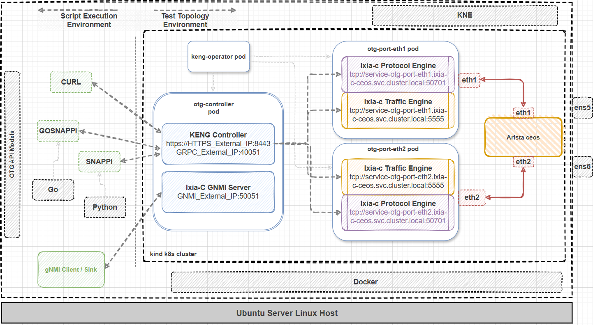
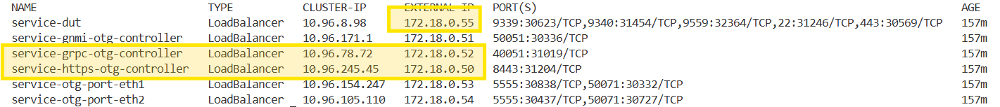
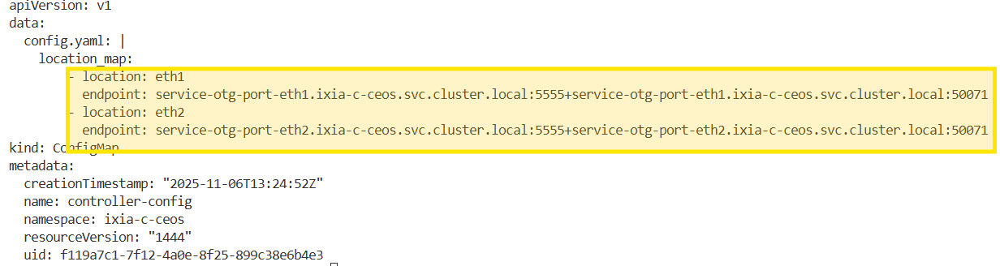
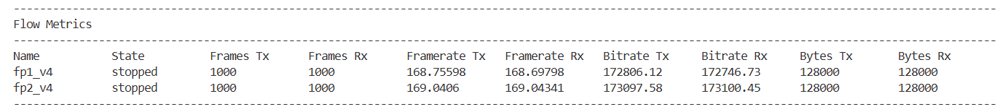
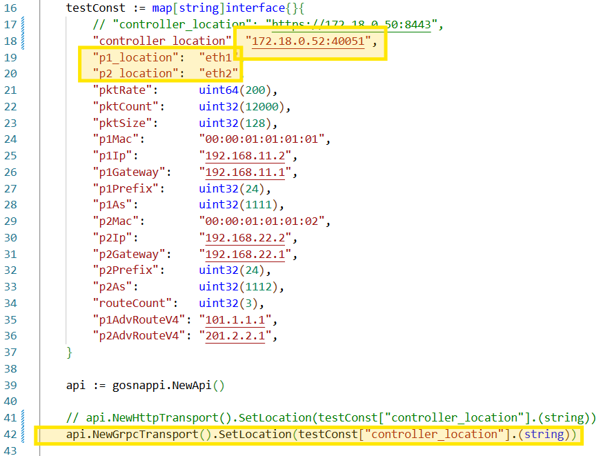
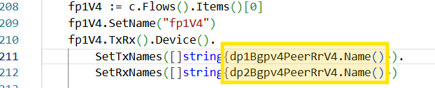
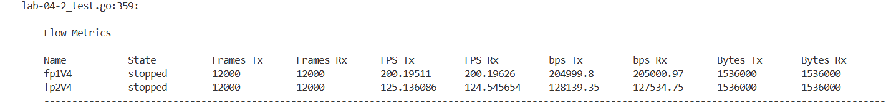
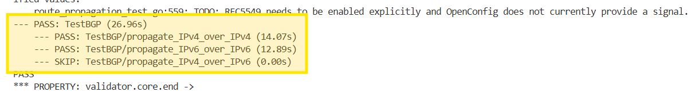

# Lab 04 Instructions

## Overview

In this lab we will use [**kne**](https://github.com/openconfig/kne) (Kubernetes Network Emulation) and [**kind**](https://kind.sigs.k8s.io/) (Kubernetes In Docker) to deploy a two otg ports plus one device under test topology. Similarily to containerlab, kne uses configuration files to deploy test topologies over k8s clusters. [**Ixia-c**](https://ixia-c.dev) uses the [**keng operator**](https://github.com/open-traffic-generator/keng-operator) component which assists in the otg ports deployment.
We will use both **snappi** and **gosnappi** to run the provided script and we will also run an openconfig [**featureprofiles**](https://github.com/openconfig/featureprofiles) test.

The goal of this lab is to familiarize the users with gosnappi and kne concepts but also with running tests over kubernetes clusters.

We will only require 1 VM for this lab. Deployment and logical topology below.



## Prerequisites

- snappi must be installed at this point. If not, use the command below to do it.

```Shell
python3 -m pip install --upgrade snappi --break-system-packages
```

- Install [**kind**](https://kind.sigs.k8s.io/). This will allow us to create a single node kubernetes cluster.

```Shell
[ $(uname -m) = x86_64 ] && curl -Lo ./kind https://kind.sigs.k8s.io/dl/v0.30.0/kind-linux-amd64
cd && chmod +x ./kind
sudo mv ./kind /usr/local/bin/kind
```

- Install [**kubectl**](https://kubernetes.io/docs/tasks/tools/install-kubectl-linux/). This utility allow us to control the k8s cluster.

```Shell
cd && curl -LO https://dl.k8s.io/release/v1.34.0/bin/linux/amd64/kubectl
sudo install -o root -g root -m 0755 kubectl /usr/local/bin/kubectl
```

- Install [**kne**](https://github.com/openconfig/kne) (Kubernetes Network Emulation). This utility will allow us to deploy network topologies over k8s clusters.

```Shell
cd
wget https://github.com/openconfig/kne/archive/refs/tags/v0.3.0.tar.gz && tar -xvzf v0.3.0.tar.gz
cd kne-0.3.0 && make install
```

- Install [**gnmic**](https://github.com/openconfig/gnmic). This utility will allow us to run gnmi commands.

```Shell
bash -c "$(curl -sL https://get-gnmic.openconfig.net)"
```

- Clone [**featureprofiles**](https://github.com/openconfig/featureprofiles) repository. These tests define groups of [***OpenConfig***](https://github.com/openconfig/public) paths that can be invoked on network devices.

```Shell
cd && git clone https://github.com/openconfig/featureprofiles.git
```

## Execution

- Create the kind cluster

```Shell
cd ~/ac4-workshop/lab-04/ && kne deploy kind-bridge.yaml
```

- Load images into the k8s cluster by running the **load-images.sh** utility.

```Shell
./load-images.sh
```

- Deploy the kne topology. This topology contains two otg ports and one [**Arista ceos**](https://containerlab.dev/manual/kinds/ceos/) device under test (dut). Take a moment to observe the topology file **ixia-c-ceos.textproto**. It contains the nodes and the links between them.

```Shell
kne create ixia-c-ceos.textproto
```

- Let's check the k8s pods status. There are three "otg test" pods running, the otg-controller and the two "otg ports" pods. The controller pod contains the keng-controller container and the Ixia-c-gnmi-server which we'll use later to retrieve statistics. The otg-port pods contain the Ixia-c-traffic-engine and Ixia-c-protocol-engine containers. You can use `kubectl describe pod <pod-name> -n ixia-c-ceos` to get more information about each pod.

```Shell
kubectl get pods -A
```


- The **br_netfilter** module should be loaded. If not, load it using the `modprobe` command below.

```Shell
lsmod | grep br_netfilter || sudo modprobe br_netfilter
```

- Let's check the k8s services to get the external IP addresses of the http and grpc services but also the dut IP address.

```Shell
kubectl get services -n ixia-c-ceos
```


- You can ssh into the **dut** pod using the dut IP address `ssh admin@172.18.0.55` (password: "admin") or you can exec into the pod using kubectl as shown below and inspect the running configuration.

```Shell
kubectl exec -it -n ixia-c-ceos dut -- Cli
```
```Shell
enable
show running-config
```


- As you can see the dut is already configured with basic interfaces and BGP configuration. Let's open **lab-04-1_test.py** script and update the controller address and ports location.


- Similarly to containerlab, the otg ports location are set as **eth1** and **eth2**. That is because the **otg_controller** pod has a config map which makes the translation to the actual container information ... as seen in **lab-01_part-2.py**

```Shell
kubectl get configmap controller-config -n ixia-c-ceos -o yaml
``` 




- Let's run the python script to generate traffic between the two otg ports. 

```Shell
cd ~/ac4-workshop/lab-04/ && python3 lab-04-1_test.py
```

- The test should complete successfully with no packet loss.



- Let's open the gosnappi version of the same script, **lab-04-2_test.go** and update the controller address and ports location. This time we will use the grpc transport instead of http. Notice the transport change in the code. The otg-controller is listening on port 40051 for grpc connections.



- Let's run the go script to establish BGP, exchange routes and generate traffic between the two otg ports using the bgp route ranges...see the snipped below for one of the flows.



```Shell
go test -v lab-04-2_test.go
```

- The test should complete successfully with no packet loss.



- Let's run some gnmi commands against the otg-controller pod to verify the BGP state. The otg gnmi server is listening on port 50051 and the external IP address can be retrieved from the k8s services list above. With otg we can use gnmi for telemetry only and the "yang" models supported are listed here [otg yang models](https://github.com/open-traffic-generator/models-yang/tree/main/artifacts). 

```Shell
gnmic -a 172.18.0.51:50051 --skip-verify -u admin -p admin get --path "/flows"
gnmic -a 172.18.0.51:50051 --skip-verify -u admin -p admin get --path "/ports"
gnmic -a 172.18.0.51:50051 --skip-verify -u admin -p admin get --path "/bgp-peers/bgp-peer[name=dp1Bgpv4Peer]"
```

### Running an openconfig featureprofiles test

- Let's run an openconfig featureprofiles test against the dut pod. We will use the [**bgp route propagation test**](https://github.com/openconfig/featureprofiles/tree/main/feature/bgp/addpath/otg_tests/route_propagation_test) which verifies that the routes learned from one BGP peer are propagated to the other BGP peer.
- It is worth mentioning that all the featureprofiles tests use gosnappi and the devices under test start with a clean configuration. In our case the Arista ceos config is found [***here***](https://github.com/openconfig/featureprofiles/blob/main/topologies/kne/arista/ceos/config.cfg). During the test execution, the dut will be reconfigured using the openconfig paths ("feature profiles") defined in the test.
- First run may take some time as the required go modules are downloaded.

```Shell
cd ~/featureprofiles
go test -v feature/bgp/addpath/otg_tests/route_propagation_test/route_propagation_test.go -kne-topo ~/ac4-workshop/lab-04/ixia-c-ceos.textproto -default_creds admin/admin
```

- The test should complete successfully.



- You can inspect the dut configuration again to see the changes applied by the featureprofiles test.

```Shell
kubectl exec -it -n ixia-c-ceos dut -- Cli
```
```Shell
enable
show running-config
```


## Cleanup

- We delete the cluster using the command below. 

```Shell
kind delete cluster --name kne
```
