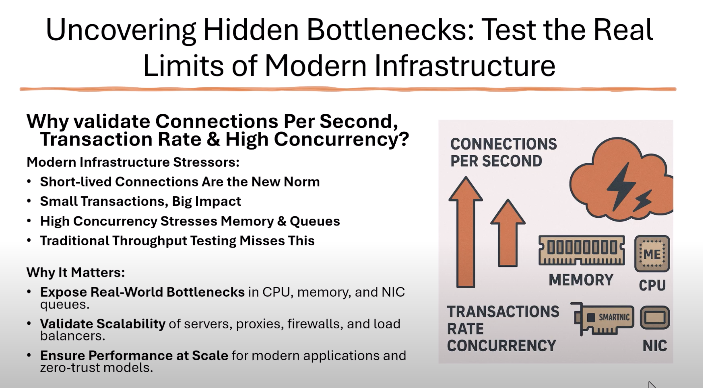

# CyPerf-CE: Next-Generation Network Performance Testing

## Why Traditional Tools Fall Short in Modern Networks

### The Core Problem: Your Network Isn't Just a Pipe

Traditional tools like iPerf were built for a simpler time. They answer one question: **"How fast is my network pipe?"**

In today's world of microservices, APIs, cloud-native applications, and Zero Trust security architectures, that's no longer the right question. The real bottlenecks aren't in raw bandwidth—they're hidden deep within the components that handle connections, sessions, and transactions.

---

## Understanding Modern Network Stress Factors

Today's infrastructure faces unprecedented challenges:

### 🔥 **Connection Rate**
- Thousands of new, short-lived connections per second
- Rapid connection establishment and teardown cycles
- Overwhelming connection state tables

### ⚡ **High Concurrency**
- Tens of thousands of simultaneous active sessions
- Complex state management requirements
- Resource exhaustion under load

### 📊 **Transaction Overhead**
- Cumulative impact of countless small request/response packets
- Application-layer protocol complexity
- Real-world traffic patterns vs. synthetic streams

---

## The iPerf Blind Spot

> **iPerf will tell you your 10Gbps link is fine, while your firewall is melting down and dropping user connections.**

iPerf measures bandwidth. It doesn't measure what matters most:
- ❌ Connection handling capacity
- ❌ Session state management
- ❌ Application-layer performance
- ❌ Security device impact
- ❌ Real-world traffic patterns
- ❌ Transaction-level metrics

---

## CyPerf-CE: The Complete Solution

### 🎯 Stop Guessing. Start Validating.

CyPerf-CE gives you the power to find performance bottlenecks **before** they impact your customers. Answer critical questions with confidence:

#### ✅ Firewall Validation
**"Can our new firewall really handle our production traffic profile?"**
- Test realistic connection rates and patterns
- Validate concurrent session capacity
- Identify breaking points before deployment

#### ✅ Load Balancer Capacity Planning
**"What is the maximum number of concurrent users our load balancer can support?"**
- Simulate real user behavior
- Test session persistence under load
- Validate failover scenarios

#### ✅ Microservices Performance
**"Will our microservice architecture scale under high request rates?"**
- Generate application-realistic traffic
- Test API gateway performance
- Validate service mesh behavior

---

## Why CyPerf-CE Wins

### 🏆 **Modern Architecture Support**
Built from the ground up for today's cloud-native, microservices-based infrastructure.

### 🏆 **Real-World Traffic Simulation**
Generate traffic patterns that mirror actual production workloads, not just synthetic streams.

### 🏆 **Comprehensive Metrics**
Go beyond bandwidth to measure what really matters: connections, sessions, transactions, and application performance.

### 🏆 **Security-Focused Testing**
Purpose-built to stress-test firewalls, proxies, and security devices under realistic conditions.

### 🏆 **Open Source & Community-Driven**
Available on GitHub with active development and community support.

> *CyPerf-CE: Because your network deserves better than bandwidth tests.*

