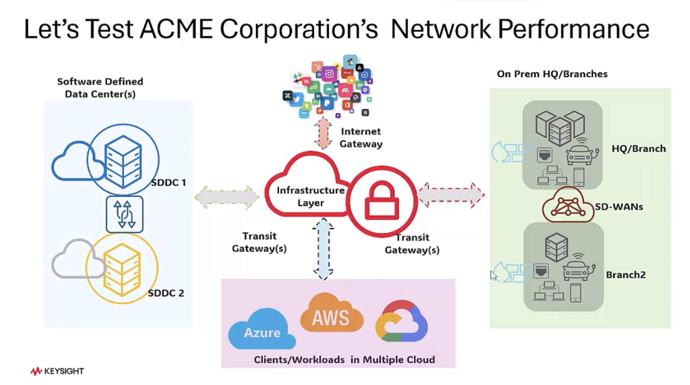

# Lab 05 Instructions

## Background



Acme Corporation operates a diverse IT environment, encompassing Software-Defined Data Center (SDDC), cloud infrastructure, and on-premises data center deployments. To ensure seamless service delivery to end customers, Acme must deploy its services in a distributed manner. These services may run within a single type of infrastructure or span across all three environments.

A key characteristic of these services in todays's era of modern, cloud-native architectures built on microservices is their need to support a large number of simultaneous user connections and frequent, lightweight transactions—such as chat messages or API calls.


## Lab Objective


To deploy [**CyPerfCE**](https://www.cyperf.com/) VM's and run a stateful connection and transaction rate test to stress the network's compute and packet-per-second capacity. We would be looking at Connections Per Second as our KPI.

## Hardware Requirements

We will only require 2 VMs for this lab. One as cyperf-ce server and other as cyperf-ce client. 

Deployment and logical topology below.


## Prerequisites

- Two networked systems (Virtual Machines or Containers) capable of communicating with each other.

- CyPerf Community Edition installed on both systems (the video demonstrates a Docker deployment for one side.

- The IP address of the system that will act as the Server.

## Step-by-Step Procedure

### Phase 1: Install cyperf-ce module on your Client and Server VM's

- Follow the installation instructions provided in this [setup script](setup_cyperf_on_agent.sh).

### Phase 2: Deploying the Server Agent

- The first step is to designate one of your VM as the "Server" agent, which will passively wait for connection requests from the "Client" agent.

- SSH into the Server VM and start the server process. 

Connection rate test with default limits. 
```bash
sudo cyperf -s –cps 
```

** Bonus: You can also run connection rate test with custom payload size. 


```bash
sudo cyperf -s –cps –-length 1k
```

This cyperf server agent will bind to an IP address and listen for incoming client connections.

** Note this IP address as it would be your server ip address that client will connect to. Let's call it SERVER_IP_ADDR

You should see a trace like below on your VM


Please explore various options and their explanations at [OPTIONS.md])(https://github.com/Keysight/cyperf/blob/main/cyperf-ce/OPTIONS.md)


### Phase 2: Deploying the Client Agent

- The second step is to use the "Client" agent on VM you have designated and Client VM to initiate a stateful connection test against the Server, targeting a specific Connections Per Second (CPS).

- SSH into the Client VM and run the client process. 

Connection rate test with target CPS of 1000 connections per second

```bash
sudo cyperf -c SERVER_IP_ADDR --cps 1000
```

** Bonus: Along with the CPS goal you can also set the packet size for CPS test. Smaller packets get you better CPS results.

```bash
sudo cyperf -s --cps 10k/s --length 1
```

See trace as below on you Client VM.


### Phase 2.1:


### Phase 3: Statistics Analysis

Observe the results that would be continuously running on both your VM's. Pay attention to "Connection Rate" statistics since that is our KPI for this test.


### Phase 3: Stop the Test

- can stop the test manually from client VM agent manually (Ctrl+C) 

  OR

- You can use '--time' flag on client side to setup a test run duration before the test run


### Phase 4: Test Summary

You will be able to see the test run summary snapshot of Connections Per Second(CPS) KPI 


### Phase 5: Other useful options when running cyperf - ce tests.

All the below options are to be used client side VM before running the test. 
If we need a flag to be added on server side VM as well, it will be specified in command help

``` bash
--parallel / -P  <Number of parallel client sessions to run>

Tuning this option can help in improving bitrate and connection rate.
Default: Number of available CPU cores.
Max: 64000
```


```bash
--bind  <interface ip>


Bind to the interface associated with the IP address . If multiple interfaces on client VM, you can chosse the interface to use to send traffic to server.
Default: Cyperf will select the required IP address and interface from linux route table.
```

```bash

--port

Server will listen on the specified port.
Client will connect to the specified port.
Default: 5201
```

```bash
--file <filepath>

Transmit / receive the specified file.
cyper will attempt to use this file as a single block to read and write repeatedly. The file needs to exist in the specified path, cannot be empty and cannot be more than 128 megabytes in size.
If this option is used, it must be used in both server and client commands.
This option cannot be used together with -l / --length option.
```

```bash

--bidir 

In this mode both client and server send and receive data simultaneously.
If this option is used, it must be used in both server and client commands.
This option cannot be used together with -R / --reverse option.


--reverse

In this mode, server sends and client receives the data.
If this option is used, it must be used in both server and client commands.
This option cannot be used together with --bidir option

```

``` bash
--csv-stats <filepath>


Write all stats to specified csv file. The stats are stored at times as specified by  "--interval" 
```

```bash

--detailed-stats
Show more detailed stats in console.
This option can be used to show more detailed stats like ARP stats, ethernet and IP level packet stats and TCP stats.
```


### Phase 6: Cleanup
On your server VM, Ctrl+C the Server to stop it 

### Conclusion

The CyPerf CE lab successfully proved the system's ability to handle X Connections Per Second (CPS), even with minimal Y-byte packets.

This test is critical because it goes beyond simple throughput measurements to expose real-world limits:

- Stress Test: It maximizes the packets per second (PPS) and forces the CPU to manage immense connection setup and teardown overhead.

- Identifies Bottlenecks: It validates the true scalability of the server, proxies, and firewalls by stressing memory and queue capacity.

- Ensures Stability: By confirming performance under high concurrency, this benchmark ensures the foundation is stable for modern applications that rely on short-lived connections and frequent, small transactions.

This validation provides the necessary assurance of performance at scale for critical infrastructure.


---

## 🚀 **BONUS SECTION: Running Throughput Tests with CyPerf CE!**

Want to push your network to its absolute limits? In this **BONUS LAB**, we'll show you how to run *throughput* tests using CyPerf CE. While our main lab focused on measuring Connections Per Second (CPS), throughput tests measure the maximum amount of data your network can handle (bits per second).

### Why Run Throughput Tests?

- **Real-World Readiness:** Understand the bandwidth capabilities of your network infrastructure.
- **Identify Bottlenecks:** Detect slow points in the path between client and server.
- **Optimize Deployments:** Tune your systems for maximum performance.

### How to Run a Throughput Test

#### 1. **Start the Server**

SSH into your **server VM** and start the server to listen for throughput tests:

```bash
sudo cyperf -s
```
Note <SERVER_IP_ADDR> to be used with client agent in next step.

#### 2. **Start the Client in Throughput Mode**

SSH into the **client VM** and run the following command, replacing `<SERVER_IP_ADDR>` with your server's actual IP address:

```bash
sudo cyperf -c <SERVER_IP_ADDR> -b <target_throughput>
```

```bash
-b, --bitrate #[KMG][/#]	Target bitrate in bits/second.

Default: 10G/s 
Max: 10G/s
This option cannot be used with --cps option.
```


#### 3. **Customize Your Test!**

You can add additional optional arguments, such as:

- `--duration 60`  (Run the test for 60 seconds)
- `--length 1400`  (Use 1400-byte packets)

#### 4. **Read the Output**

After the test completes, you'll see reports showing total throughput (in Mbps/Gbps), latency, retransmissions, and more. Use --detailed-stats for detailed result analysis


> Test Summary


### If Iperf... then Why CyPerf?

Curious how CyPerf differs from the popular tool Iperf? CyPerf offers unique test workflows and cloud-native features designed for modern distributed architectures.

[**Tell me**](IperfVsCyperf.md)


---

**Give it a try and see how much data your setup can move!**

> *Note: You can always refer to the CyPerf CE documentation or `cyperf` for a full list of configurable options.*

---


