# Lab 05 Instructions

## Overview

In this lab we will use [**CyPerfCE**](https://www.cyperf.com/) agents to run a stateful connection and transaction rate test to stress the network's compute and packet-per-second capacity. VM1 will act as the cyperf-ce client and VM2 as cyperf-ce server. These VM's have been spun up as part of your lab environment and we would be looking at Connections Per Second as our Key Performance Indicator (KPI). 

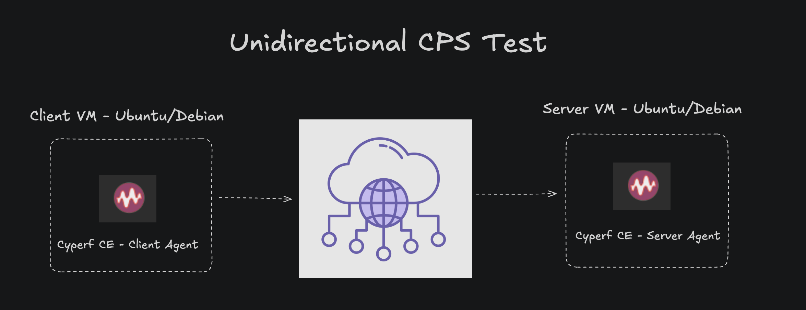

Deployment topology below.

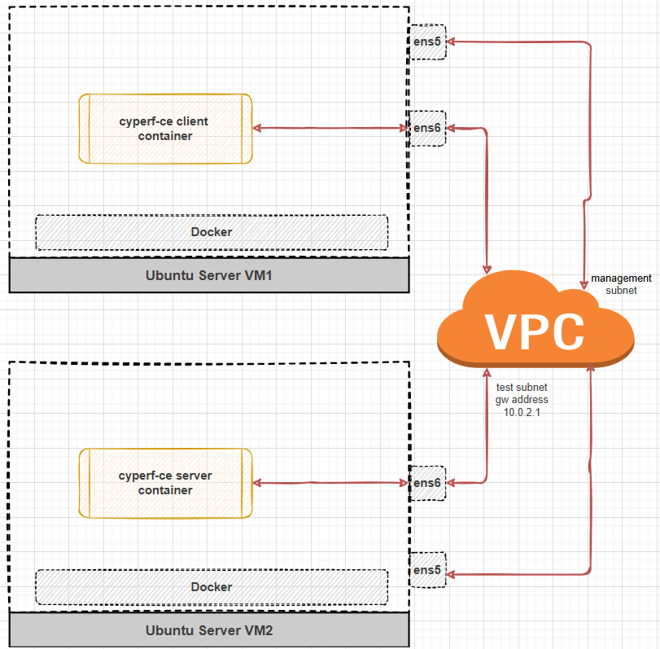


## Prerequisites

- Two networked systems (Virtual Machines or Containers) capable of communicating with each other - Cyperf-CE server(VM2) and other as Cyperf-CE client (VM1)
- CyPerf Community Edition installed on both systems. Explained further in "Phase 1"

## Step-by-Step Procedure

### Phase 1: Install cyperf-ce module on your Client and Server VM's

- Run the [setup script](setup_cyperf_on_agent.sh) on VM1 and VM2.

```Shell
cd ~/ac4-workshop/lab-05/
chmod +x setup_cyperf_on_agent.sh
./setup_cyperf_on_agent.sh
```

### Phase 2.1: Deploying the Server Agent on VM2

- VM2 is used as the "Cyperf CE Server" agent, which will passively wait for connection requests from the "Cyperf CE Client" agent (VM1).
- On VM2 start the server process. 

```bash
sudo cyperf -s --cps 
```

** Bonus: You can run connection rate test with custom payload size `sudo cyperf -s --cps –-length 1k`

This cyperf server agent will bind to all the IP addresses on VM2 unless we specify *--bind 'ip'* in the command.  In our lab we will be using **ens6** - 10.0.2.22 as server IP

** Note this IP address as it would be your server ip address that client will connect to. Let's call it **SERVER_IP_ADDR**.


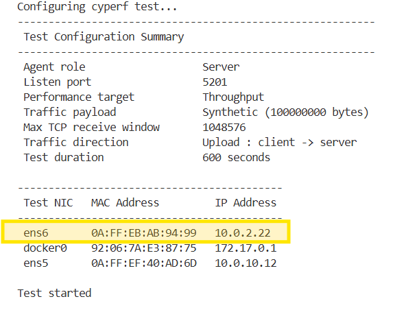

You can explore various options and their explanations at [Cyperf Options](https://github.com/Keysight/cyperf/blob/main/cyperf-ce/OPTIONS.md)


### Phase 2.2: Deploying the Client Agent on VM1

- The second step is to use the "Cyperf CE Client" agent on VM1 to initiate a stateful connection test against the Server (VM2), targeting a specific Connections Per Second (CPS).
- On VM1 start the client process with below command. Replace **SERVER_IP_ADDR** with actual server ip address noted in previous step. If multiple interfaces on client VM, you can choose the active interface by using the *--bind* option. By default, cyperf will select the required IP address and interface from linux route table based on the destination.

- On VM1 we're setting the connection rate test with target CPS of 1000 connections per second `sudo cyperf -c SERVER_IP_ADDR --cps 1000`

```bash
sudo cyperf -c 10.0.2.22 --cps 1000
```

** Bonus: Along with the CPS goal you can also set the packet size for CPS test. Smaller packets get you better CPS results `sudo cyperf -c SERVER_IP_ADDR --cps 10k/s --length 1`


See trace as below on your Client VM.

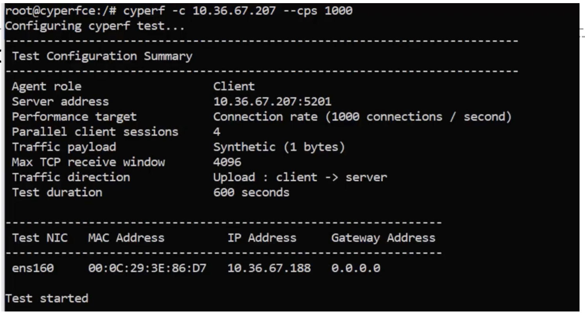


### Phase 3: Statistics Analysis

- Observe the results that would be continuously running on both your VM's. Pay attention to "Connection Rate" statistics since that is our KPI for this test.

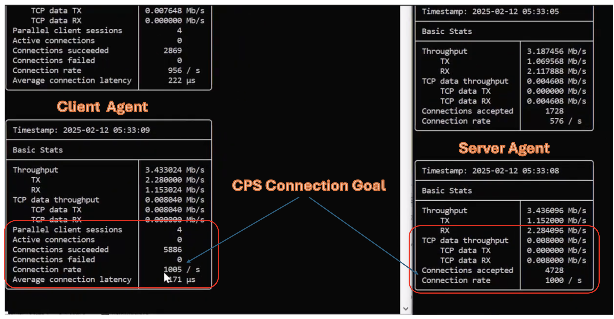

### Phase 3: Stop the Test

- On VM1 you can stop the test manually with **Ctrl+C** after running for a desired duration.

  OR

- The test would have stopped automatically if the *--time* flag was used upon starting the test in the previous step. For example, to run the test for 2 minutes, you would start the client with the following command: `sudo cyperf -c SERVER_IP_ADDR --cps 1000 --time 120`


### Phase 4: Test Summary

- You will be able to see the test run summary snapshot of Connections Per Second(CPS) KPI 

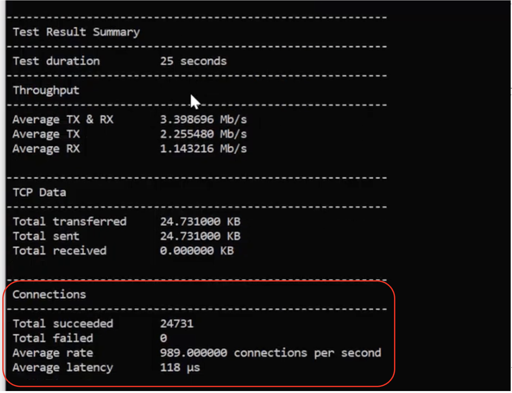


### Phase 5: Other useful options when running cyperf-ce tests.

All the below options are to be used client side VM before running the test. 
If we need a flag to be added on server side VM as well, it will be specified in command help


**--parallel / -P**  *Number of parallel client sessions to run. Tuning this option can help in improving bitrate and connection rate. Default: Number of available CPU cores. Max: 64000*

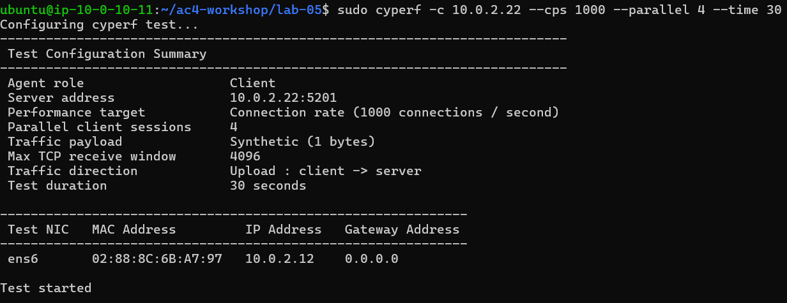


**--bind  'interface ip'** *Bind to the interface associated with the IP address . If multiple interfaces on client VM, you can chosse the interface to use to send traffic to server.
Default: Cyperf will select the required IP address and interface from linux route table.*

**--port**  *Server will listen on the specified port.
Client will connect to the specified port.
Default: 5201*

**--file 'filepath'**  *Transmit / receive the specified file.
cyper will attempt to use this file as a single block to read and write repeatedly. The file needs to exist in the specified path, cannot be empty and cannot be more than 128 megabytes in size.
If this option is used, it must be used in both server and client commands.
This option cannot be used together with -l / --length option.*


**--bidir** *In this mode both client and server send and receive data simultaneously.
If this option is used, it must be used in both server and client commands.
This option cannot be used together with -R / --reverse option.*


**--reverse**  *In this mode, server sends and client receives the data.
If this option is used, it must be used in both server and client commands.
This option cannot be used together with --bidir option*

**--csv-stats 'filepath'**  *Write all stats to specified csv file. The stats are stored at times as specified by '--interval'*

**--detailed-stats** *Show more detailed stats in console. This option can be used to show more detailed stats like ARP stats, ethernet and IP level packet stats and TCP stats.*

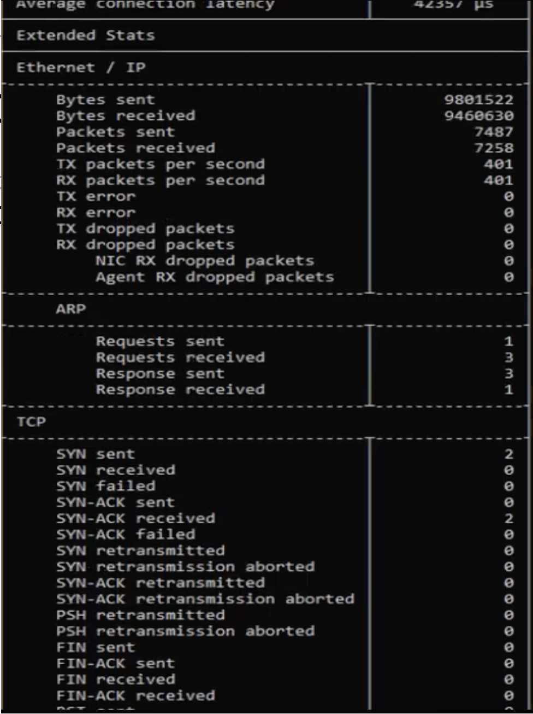


### Phase 6: Cleanup
- On VM2, unless already stopped, you can stop the server with **Ctrl+C**

### Conclusion

The CyPerf CE lab successfully proved the system's ability to handle X Connections Per Second (CPS), even with minimal Y-byte packets.

This test is critical because it goes beyond simple throughput measurements to expose real-world limits:

- Stress Test: It maximizes the packets per second (PPS) and forces the CPU to manage immense connection setup and teardown overhead.

- Identifies Bottlenecks: It validates the true scalability of the server, proxies, and firewalls by stressing memory and queue capacity.

- Ensures Stability: By confirming performance under high concurrency, this benchmark ensures the foundation is stable for modern applications that rely on short-lived connections and frequent, small transactions.

This validation provides the necessary assurance of performance at scale for critical infrastructure.


---

## 🚀 **BONUS SECTION: Running Throughput Tests with CyPerf CE!**

Want to push your network to its absolute limits? In this **BONUS LAB**, we'll show you how to run *throughput* tests using CyPerf CE. While our main lab focused on measuring Connections Per Second (CPS), throughput tests measure the maximum amount of data your network can handle (bits per second).

### Why Run Throughput Tests?

- **Real-World Readiness:** Understand the bandwidth capabilities of your network infrastructure.
- **Identify Bottlenecks:** Detect slow points in the path between client and server.
- **Optimize Deployments:** Tune your systems for maximum performance.

### How to Run a Throughput Test

#### Phase 1.1. *Deploying the Server Agent on VM2*

- On VM2 and start the server to listen for throughput tests:

```bash
sudo cyperf -s
```

#### Phase 1.2. **Deploying the Client Agent on VM1**

- On VM1 run the following command, replacing **SERVER_IP_ADDR** with your saved IP address from the CPS test. `sudo cyperf -c 'SERVER_IP_ADDR' -b 'target_throughput'`. We'll use the parameter *-b, --bitrate*. This is the target bitrate in bits/second with the default of 10G/s and a maximum of 10G/s. This option cannot be used with *--cps* option.


```bash
sudo cyperf -c 10.0.2.22 -b 2G/s --time 60
```


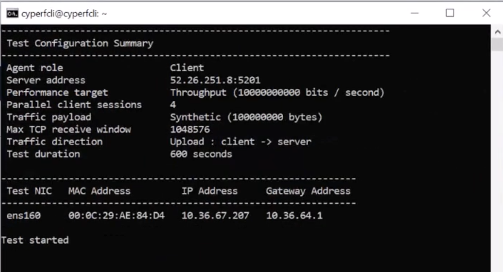

#### 3. **Customize Your Test!**

You can add additional optional arguments, such as: `--length 1400`  (Use 1400-byte packets)

#### 4. **Read the Output**

- Side by side stats on Client and Server VM's.

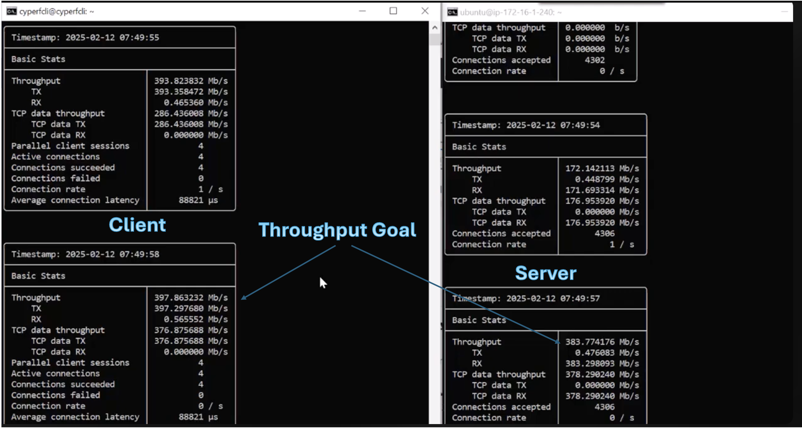

- After the test completes, you'll see reports showing total throughput (in Mbps/Gbps), latency, retransmissions, and more. Use *--detailed-stats* for detailed result analysis.
- Test Summary on the Client VM1

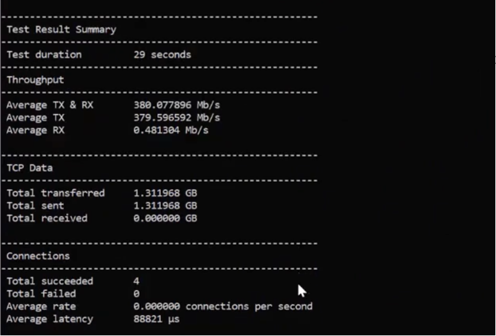

- Test Summary on the Server VM2

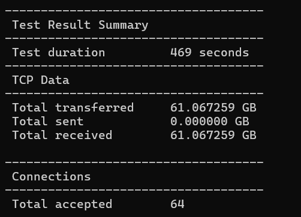


### If Iperf... then Why CyPerf?

Curious how CyPerf differs from the popular tool Iperf? CyPerf offers unique test workflows and cloud-native features designed for modern distributed architectures. 

[**Tell me**](IperfVsCyperf.md)


