# Lab 06 Instructions

## Overview
In this lab we're going to use [**Cyperf**](https://www.keysight.com/us/en/products/network-test/cloud-test/cyperf.html) to generate http traffic between 2 cloud VMs (Cyperf Agents).
The goal of the lab is to get familiar with Cyperf architecture and how to deploy Cyperf agents using docker containers. We will also create simple tests to generate mixed traffic between the 2 agents and monitor the traffic using the Cyperf controller UI.

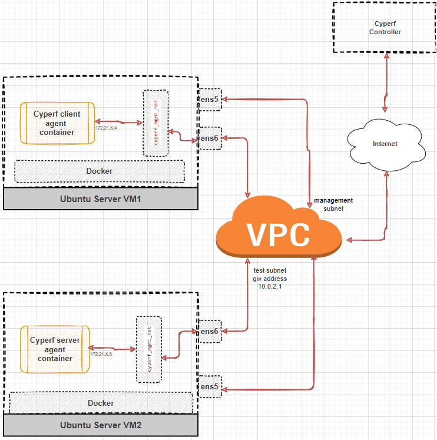


## Prerequisites

We will assign **VM1** as Cyperf Client Agent and **VM2** as Cyperf Server Agent.

## Client Configuration

- On VM1 creat the client docker network. Create a network with the subnet 172.21.X.0/24 where **X** is your assigned **STUDENT_NUMBER**.

```Shell
docker network create --subnet=172.21.x.0/24 cyperf_mgmt_net
```

- Use your name to label the container properly. For example, if your name is John, use: ***--name john-client***
- Each student should replace ***CONTROLLER_ADDRESS*** with the IP address of the controller VM provided in your lab environment.
- Assign Client IP Address. Choose an IP address within the **172.21.X.0/24** subnet, ensuring it’s different from the server’s IP. Example: **172.21.6.4**

- Deploy the Client Agent. The CyPerf agent image may take a little while to download. Deploy the client using the command below.

```Shell
docker run -td --cap-add=NET_ADMIN --cap-add=IPC_LOCK \
--network cyperf_mgmt_net --ip=172.21.6.4 \
--name john-client                        \
-e AGENT_CONTROLLER=CONTROLLER_ADDRESS    \
-e AGENT_TAGS=john-client                 \
public.ecr.aws/keysight/cyperf-agent:latest
```

## Server Configuration

- On VM2 creat the server docker network. Create a network with the subnet 172.21.X.0/24 where **X** is your assigned **STUDENT_NUMBER**.

```Shell
docker network create --subnet=172.21.x.0/24 cyperf_mgmt_net
```

- Use your name to label the container properly. For example, if your name is John, use: ***--name john-server***
- Each student should replace ***CONTROLLER_ADDRESS*** with the IP address of the controller VM provided in your lab environment.

- Assign Server IP Address. Choose an IP address within the **172.21.X.0/24** subnet, ensuring it’s different from the client's IP. Example: **172.21.6.5**

- In the server case you need to specify the port example **-p 80:80**. This ensures the docker agent is listening to the port 80 for any incoming request from the client agent.

- Deploy the Server Agent. The CyPerf agent image may take a little while to download. Deploy the server using the command below.

```Shell
sudo docker run -td --cap-add=NET_ADMIN --cap-add=IPC_LOCK \
--network cyperf_mgmt_net --ip=172.21.6.5                  \
--name john-server                                         \
-e AGENT_CONTROLLER=CONTROLLER_ADDRESS                     \
-e AGENT_TAGS=john-server                                  \
-p 80:80                                                   \
public.ecr.aws/keysight/cyperf-agent:latest
```
- Note your VM’s interface IP, retrievable via `ip addr` or `ifconfig`. This will serve as your Device Under Test(DUT) IP in the test as the docker client agent that we deployed earlier will send the traffic to this IP. This will internally get routed to the docker server we just deployed.
In this case, we will be using **ens6** IP address.


## Running the Test

- Access the Cyperf controller UI by navigating to `http://CONTROLLER_ADDRESS` in your web browser. Each student should replace ***CONTROLLER_ADDRESS*** with the IP address of the controller VM provided in your lab environment.

- Log in using the default credentials: Username: `your email address` Password: `Ixia123!`

- After logging in, you’ll see a preconfigured “lab-06-test” test session. The objective of this test is to generate 100 connections per second using simple HTTP traffic. Click to open it. 

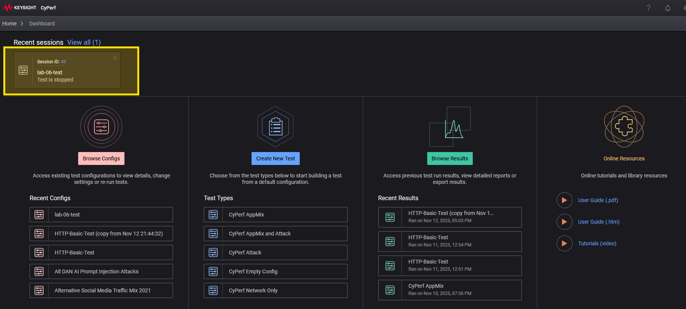

- Then we go to the "ENTERPRISEMIX" section.

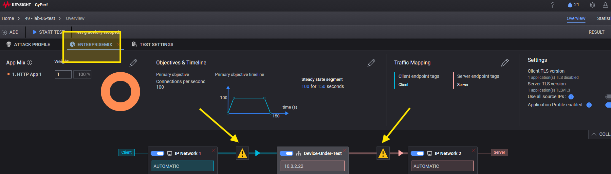

- In the test view, locate the exclamation marks beside the agent slots. Click on them to add agents.
- On the left-hand side, assign the client's port icon.
- You need to find and assign agents. A search by IP Address will ensure that we won't use someone else's agents. In my case `172.21.6`.

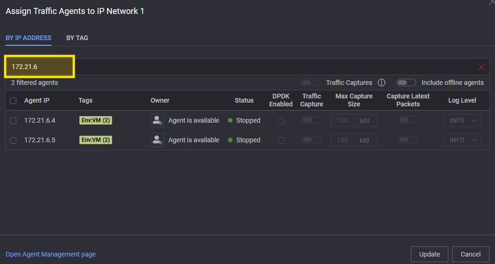

- You should find 2 addresses `172.21.X.4` and `172.21.X.5`, where **X** is your assigned **STUDENT_NUMBER**. In my example I used 172.21.6.4 while deploying the client docker agent. In your case it should be `172.21.X.4`. Select that and click Update.

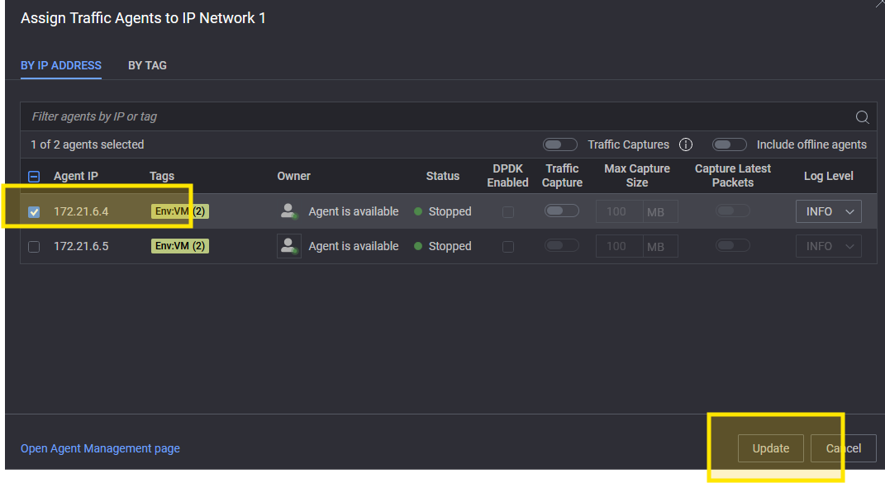

- On the right-hand side, assign the server IP. Should be `172.21.X.5` and click Update

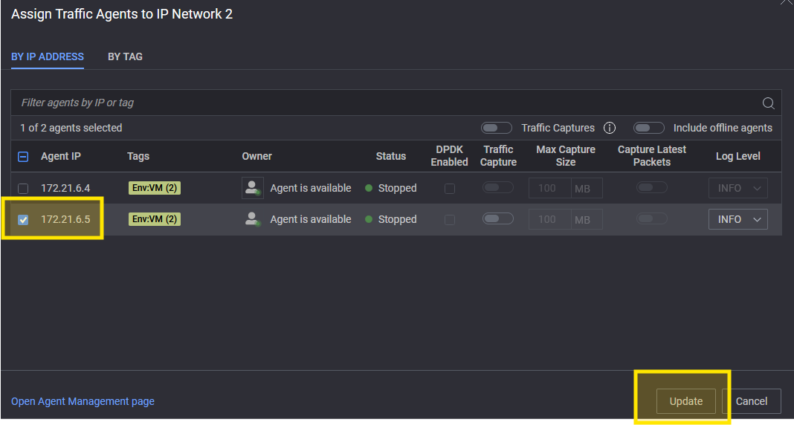

- Open the DUT Configuration Panel by clicking on the DUT tab or section.

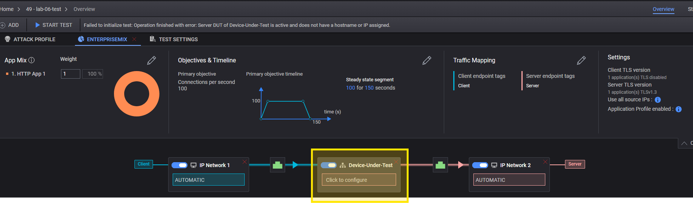

- Set the DUT IP Address. Enter the VM’s interface IP captured earlier on VM2.

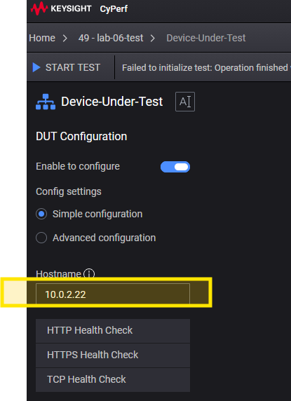

### Simple Traffic Test

- Start the Test. Click **START TEST** (blue play icon) to initiate the test.


- Once the test begins, navigate to the Statistics tab. From here, you can monitor live metrics such as throughput, latency, connection counts, and success/failure ratios. These parameters will help you understand your steady-state theoretical maximum traffic levels and your optimal latency ranges. Since this test uses basic HTTP, it does not fully represent complex real-world Internet traffic patterns, but it provides a solid baseline for your network’s core performance KPIs. We can introduce more realistic behaviors in the next steps.

    A few key KPIs to track during this phase:

    - ***Throughput (Gbps/Mbps)***: Indicates the volume of data successfully transmitted. Helps identify bandwidth ceilings and saturation points.
    - ***Connection Rate (CPS)***: Shows how quickly the system can establish new connections per second, critical for bursty, high-fanout workloads.
    - ***Concurrent Connections***: Measures how many active sessions the system can sustain, revealing memory and state-table constraints.
    - ***Latency Profile***: Includes average time-to-first-byte, time-to-last-byte latencies. These values show how predictable and stable the network is under load.
    - ***Packet Drops*** / Retransmissions: Highlights congestion, queuing issues, or bottlenecks in the path.
    - ***Success vs. Failure Ratios***: Helps identify issues such as connection resets, timeouts, or server-side resource exhaustion.
    By understanding these baseline KPIs, you’ll have a clear foundation to compare against as we introduce more realistic, application-specific traffic patterns in subsequent tests.

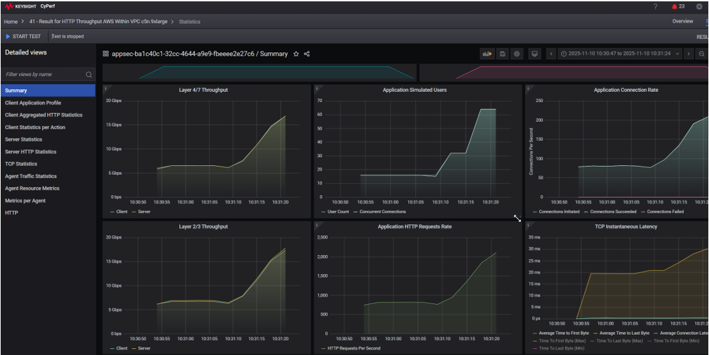

### Realistic Traffic Test

- This is the stage where we introduce realism into the test. CyPerf is now emulating actual application behaviors over the network, such as YouTube, O365, Salesforce, Jira, Gmail, and even AI traffic. This is exactly what I was referring to earlier when we discussed adding realistic patterns. You will notice that your KPIs shift significantly, and you can build a similar comparison table to show the impact of real application flows on your baseline metrics.

- CyPerf includes 500+ popular application profiles out of the box, and it also provides an AppBuilder that allows you to create your own custom application patterns. The goal is to give customers the flexibility to build environments that truly replicate their unique production network, effectively creating a digital twin of their environment for accurate performance and security validation.

- We can now make some changes to the test objective for testing throughput and to include the aforementioned applications to our mix of traffic. Click on top-right **Overview** to go back to the test configuration page, then edit the **Objectives & Timeline** section.


- Set the **Primary Objective** to **Throughput** and set the value to **100 Mbps** with a duration of **60** seconds. 

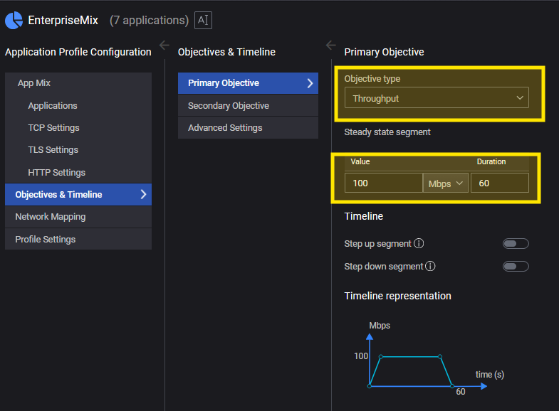


- Then click on **Applications** to activate all applications of the mix.

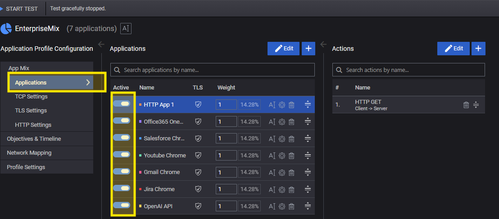

- Start the test by clicking on **START TEST** (blue play icon) to initiate the test and observe the new metrics. In the Statistics, on the left hand side selection panel, click on the **Client Application Profile** to see the breakdown of the traffic per application.

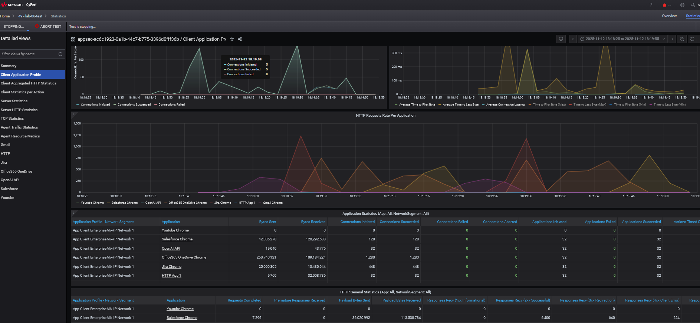

- CyPerf goes to great lengths to accurately emulate the behavior of complex modern applications, providing a detailed breakdown of each application action so users can identify issues in specific interactions, for example, a failed file upload.
- Click on the ***Ofice365 OneDrive*** application to see more details.

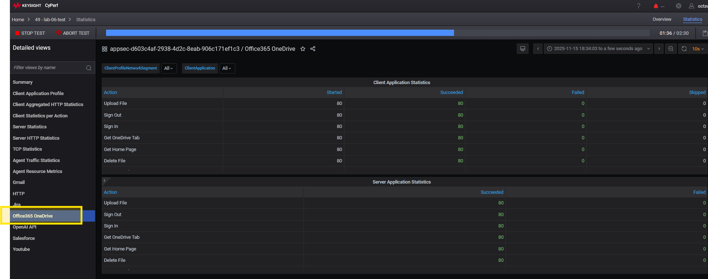


- Wait until the test stops.

### High-Realism Security + Application Testing

- This stage introduces the highest level of complexity and realism. The same CyPerf agents now emulate both **real applications** and **high-severity security attacks**, including **AI-driven prompt-injection techniques**. This is where a real network and its security systems are pushed to their true operational limits.

- Why is this stage important?
    - ***End-to-End Realism***: CyPerf emulates both clients and servers, generating traffic that closely matches what would be observed in a real network, including application flows, user behaviors, and malicious interactions.
    - ***Full Security Stack Under Test***: Any inline system that looks at Layer 4 or higher, such as the Firewall, IPS, WAF, Anti-DDoS, SASE gateways, API gateways, or other security controls, naturally becomes the System Under Test (SUT).
    - ***Evaluates Security and Performance Together***: The purpose is not just to check whether the device blocks all attacks. It is to understand how well the system performs while blocking attacks and simultaneously serving legitimate business traffic.
    - ***Reveals Hidden Trade-Offs***: Many security products degrade business KPIs when stricter policies are enabled (e.g., throughput drops, latency spikes, connection failures). These tests expose the performance penalties of increased security settings.
    - ***Quantifies Security Efficacy Under Load***: hows how the security system behaves when it has to inspect and mitigate attacks at scale, including complex threats and AI-based evasions.
    - ***Measures Business Impact***: Helps determine exactly how much security inspection slows down or disrupts real applications, critical for production readiness.
    - ***Supports Policy Tuning***: Allows teams to find the right balance between strong security controls and acceptable user experience

- We can now enable the **ATTACK PROFILE** to simulate some attacks. 
- Go back to the **Overview** page and then click on the **TEST SETTINGS** section. We're adding 2 attack profiles: **Critical Strikes** and **All Dan Gemini AI LLM Prompt Injection**. 

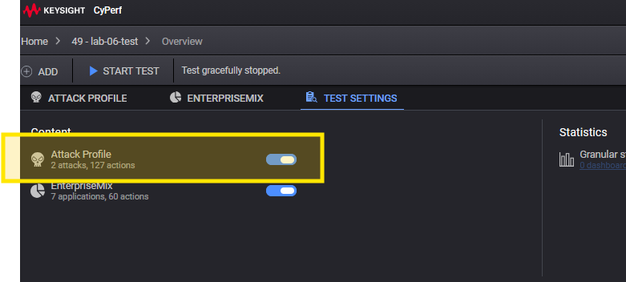

- More info on the attack profiles can be found if you go and edit the **ATTACK PROFILE** section or in the Cyper [**User Guide**](https://downloads.ixiacom.com/support/downloads_and_updates/public/KeysightCyPerf/releases/7.0/Keysight_CyPerf_7.0_ATI_ReleaseNotes.pdf). There you can find a description for each strike. These attacks will now be added to the existing traffic mix. 

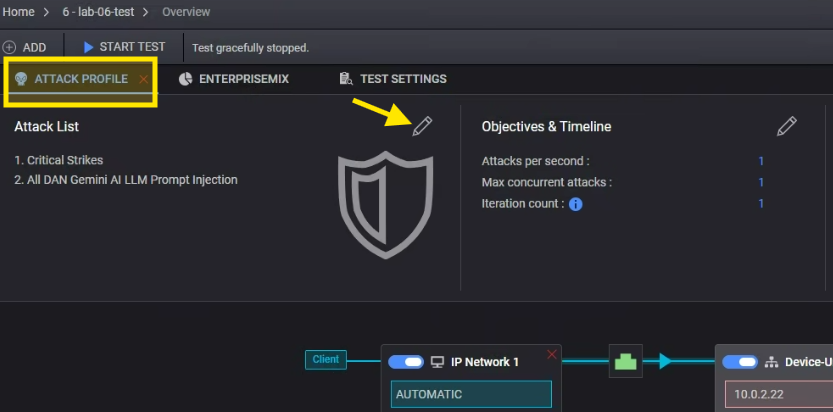
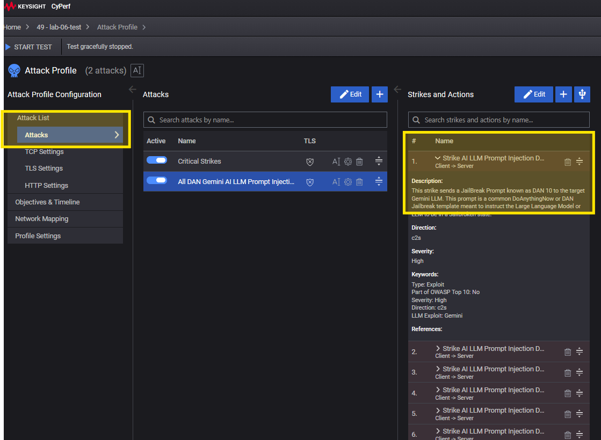

- Restart the test by clicking on **START TEST** to initiate the test and observe the new metrics.

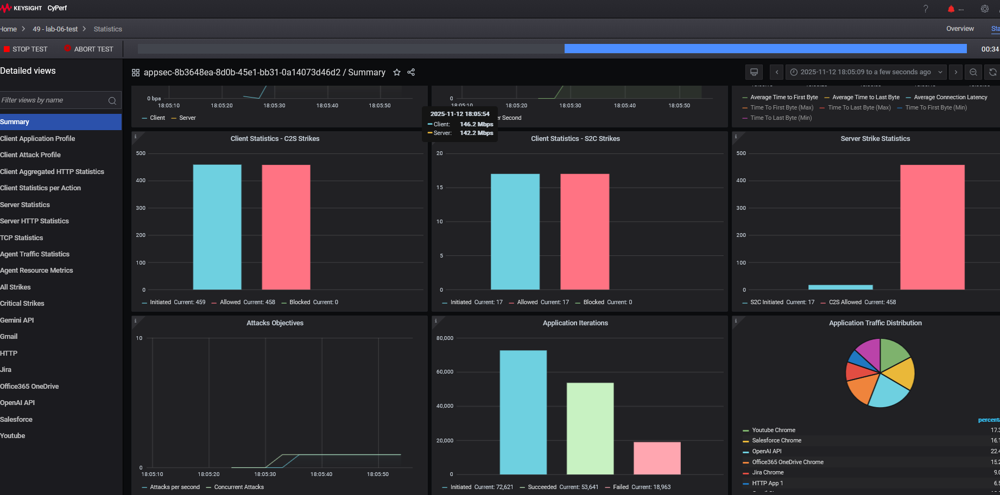

- Now that you’ve reached the most realistic and complex stage of testing, this is a good time to explore CyPerf’s detailed statistics views. These help you diagnose issues across the full stack, from L4/L7 behavior to agent resource limits.

- Key metrics and views to examine:

    - ***TCP Statistics*** Review TCP-level behavior such as connection resets, retransmissions, timeouts, SYN failures, window size issues, and handshake anomalies.
    - ***Agent Traffic Statistics (Layer 2/3)*** Understand low-level packet behavior including packet rates (pps), NIC ingress/egress failures, packet drops, arp, dns, and link-level anomalies.
    - ***Agent Resource Metrics*** Monitor CPU, memory, and interface utilization of the agents generating traffic to ensure the load is realistic and not agent limited.
    - ***Client HTTP Statistics*** Examine client-side HTTP metrics such as transaction success/fail counts, response classes (2xx, 3xx, 4xx, 5xx),  TLS issues etc
    - ***Server HTTP Statistics***  Since both clients and server stats are independently published, you can check and compare them to detect anomalies.
    - ***Packet captures*** Find out ways to enable and download captures in CyPerf.
 

## Cleanup

On both VMs, run the commands below to remove the containers and the docker network.

```Shell
docker stop $(docker ps -aq) && docker rm $(docker ps -aq)
docker network rm cyperf_mgmt_net 
```
